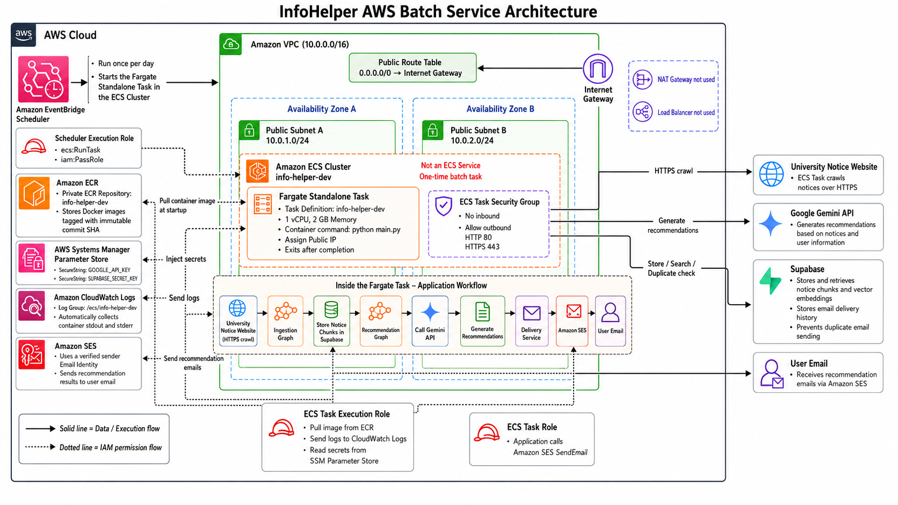

[English](README.en.md) | [한국어](README.md)

# InfoHelper

An AI-powered batch service that collects university notices, recommends relevant opportunities based on user interests, and delivers them by email.

## Key Features

- Collects university notices with Crawl4AI
- Generates personalized recommendations with Gemini and vector search
- Stores and retrieves notice chunks with Supabase pgvector
- Prevents duplicate emails by tracking delivery history
- Sends recommendation emails through Amazon SES
- Runs automatically each day with EventBridge Scheduler and ECS Fargate

## Architecture



The application runs through the following workflow:

```text
EventBridge Scheduler
→ ECS Fargate Standalone Task
→ Collect university notices
→ Store and search data in Supabase
→ Generate recommendations with Gemini
→ Send email through Amazon SES
→ Exit the task
```

The AWS infrastructure is managed with Pulumi and includes:

- A private ECR repository with immutable commit SHA image tags
- Two public subnets across separate Availability Zones
- A security group with no inbound access and outbound HTTP/HTTPS only
- Secret injection through AWS Systems Manager Parameter Store
- Separate ECS Task Execution Role and Task Role
- Container log collection with Amazon CloudWatch Logs

## Tech Stack


- Language: Python 3.12
- AI Workflow: LangGraph, LangChain, Google Gemini
- Crawling: Crawl4AI
- Database: Supabase PostgreSQL, pgvector
- Cloud: AWS ECS Fargate, ECR, SES, SSM, CloudWatch, EventBridge Scheduler
- Infrastructure as Code: Pulumi
- Container: Docker

## Local Setup

The project runs in the Miniconda `infohelper` environment.

```bash
conda activate infohelper
pip install -e ".[dev]"
python main.py
```

Create a `.env` file with the following environment variables before running the application:

```dotenv
GOOGLE_API_KEY=
SUPABASE_PROJECT_ID=
SUPABASE_SECRET_KEY=
AWS_REGION=us-east-1
SES_SENDER_EMAIL=
RECIPIENT_EMAIL=
```

> `python main.py` performs real crawling, external API calls, database writes, and email delivery.

## Docker

```bash
docker build --platform linux/amd64 -t info-helper .
docker run --env-file .env info-helper
```

## Infrastructure Deployment

```bash
conda activate infohelper
export AWS_PROFILE=infohelper
aws sso login --profile infohelper
cd infra
pulumi preview
pulumi up
```

AWS credentials and API keys must never be stored in source code or committed to Git.

## Tests

```bash
pytest test/delivery -q
```

`test/mvp1/requests_test.py` performs real network requests during import, so use caution when running the full test suite.

## Documentation

- [Project notes (Korean)](docs/Project.md)
- [Current handoff (Korean)](docs/HANDOFF.md)
