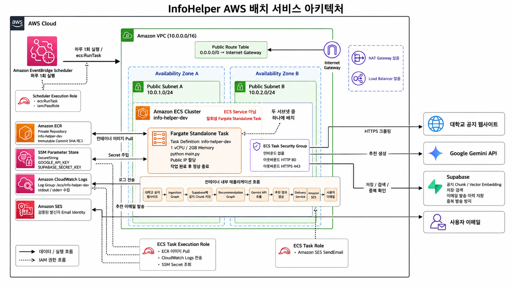

[한국어](README.md) | [English](README.en.md)

# InfoHelper

사용자가 등록한 대학교 공지 사이트에서 정보를 수집하고, 관심사에 맞는 공지를 추천해 이메일로 전달하는 서비스입니다.

현재 AWS에서 실행되는 AI 배치 파이프라인을 운영하고 있으며, 공지 출처와 사이트별 크롤링 규칙을 관리하는 FastAPI 기반 API를 확장하고 있습니다.

## 주요 기능

- Crawl4AI 기반 대학교 공지 수집
- Gemini와 Vector Search를 활용한 사용자 맞춤 추천
- Supabase pgvector 기반 공지 청크 저장·검색
- 발송 이력 저장을 통한 이메일 중복 발송 방지
- Amazon SES 기반 추천 이메일 발송
- EventBridge Scheduler와 ECS Fargate 기반 일일 자동 실행
- FastAPI 기반 공지 출처 등록 및 중복 URL 처리

## 개발 상태

완료된 범위:

- Ingestion → Recommendation → Delivery → SES 배치 파이프라인
- Pulumi 기반 AWS 인프라와 GitHub Actions 배포
- `GET /api/v1/health`
- `POST /api/v1/sources`
- Supabase 기반 Source 저장 계층
- 사이트별 크롤링 규칙 저장을 위한 DB 테이블

진행 중인 범위:

- AI가 생성한 Crawl4AI CSS 추출 규칙의 검증·저장
- 크롤링 규칙 버전 및 운영 상태 관리
- Ingestion의 Source·크롤링 규칙 DB 조회 전환
- 사용자·구독 기반 개인화 설정

> 현재 Ingestion은 `data/userURL.json`과 사이트 전용 링크 판별 규칙을 사용합니다. 임의의 공지 사이트를 자동 분석하는 기능은 아직 개발 중입니다.

## 아키텍처

### 관리 API

```text
사용자
→ FastAPI
→ Source 등록·검증
→ Supabase PostgreSQL
```

### 배치 파이프라인



```text
EventBridge Scheduler
→ ECS Fargate Standalone Task
→ Crawl4AI 공지 수집
→ Supabase 저장 및 Vector Search
→ Gemini 추천 생성
→ Amazon SES 이메일 발송
→ Task 정상 종료
```

AWS 인프라는 Pulumi로 관리하며, 주요 구성은 다음과 같습니다.

- Private ECR과 불변 Commit SHA 이미지 태그
- 서로 다른 가용영역의 Public Subnet 2개
- 인바운드 없이 HTTP·HTTPS 아웃바운드만 허용하는 Security Group
- SSM Parameter Store 기반 Secret 주입
- 역할이 분리된 ECS Task Execution Role과 Task Role
- CloudWatch Logs 기반 컨테이너 로그 수집

## 기술 스택


- Language: Python 3.12
- API: FastAPI, Uvicorn, Pydantic
- AI Workflow: LangGraph, LangChain, Google Gemini
- Crawling: Crawl4AI
- Database: Supabase PostgreSQL, pgvector
- Cloud: AWS ECS Fargate, ECR, SES, SSM, CloudWatch, EventBridge Scheduler
- Infrastructure as Code: Pulumi
- Container: Docker

## 로컬 개발 환경

Miniconda의 `infohelper` 환경을 사용합니다.

```bash
conda activate infohelper
pip install -e ".[dev]"
```

로컬 Supabase를 사용할 때는 Docker Desktop이 필요합니다.

```bash
supabase start
supabase migration up --local
```

### FastAPI 실행

```bash
uvicorn app.main:app --reload --env-file .env.local
```

현재 제공하는 엔드포인트:

```text
GET  /api/v1/health
POST /api/v1/sources
```

### 배치 실행

```bash
python main.py
```

> `python main.py`는 실제 크롤링, Gemini 호출, Supabase 저장 및 이메일 발송을 수행합니다.

## 환경변수

```dotenv
GOOGLE_API_KEY=

# SUPABASE_URL 또는 SUPABASE_PROJECT_ID 중 하나를 사용합니다.
SUPABASE_URL=
SUPABASE_PROJECT_ID=
SUPABASE_SECRET_KEY=

AWS_REGION=us-east-1
SES_SENDER_EMAIL=
RECIPIENT_EMAIL=
```

`.env`, `.env.local`, API Key와 AWS 인증정보는 Git에 커밋하지 않습니다.

## Docker

현재 Docker 이미지는 AWS 배치 실행을 대상으로 합니다. 최근 공통 클라이언트 패키지 구조 변경이 Dockerfile에 아직 반영되지 않았으므로 로컬 실행에는 위의 Python 명령을 사용합니다.

## 인프라 배포

```bash
conda activate infohelper
export AWS_PROFILE=infohelper
aws sso login --profile infohelper
cd infra
pulumi preview
pulumi up
```

## 테스트

외부 네트워크 요청이 없는 테스트는 다음과 같이 실행합니다.

```bash
pytest \
  test/api \
  test/repositories \
  test/schemas \
  test/delivery \
  test/ingestion_graph \
  test/recommendation_graph \
  -q
```

`test/mvp1`, `test/mvp2`에는 실제 네트워크 요청을 수행하는 테스트가 있으므로 기본 테스트 명령에서 제외합니다.

## 문서

- [프로젝트 기획](docs/Project.md)
- [작업 인계 문서](docs/HANDOFF.md)
